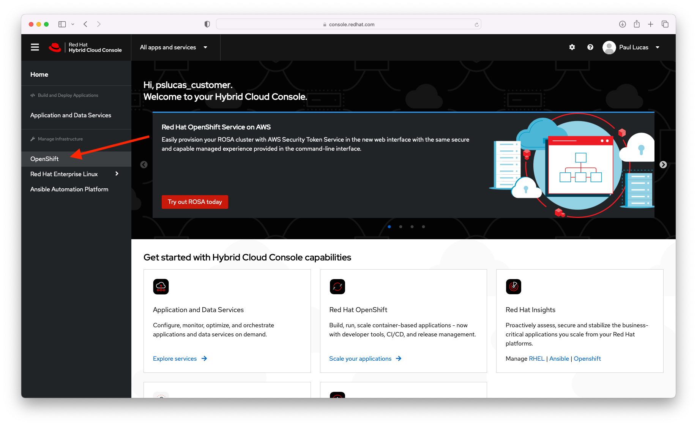
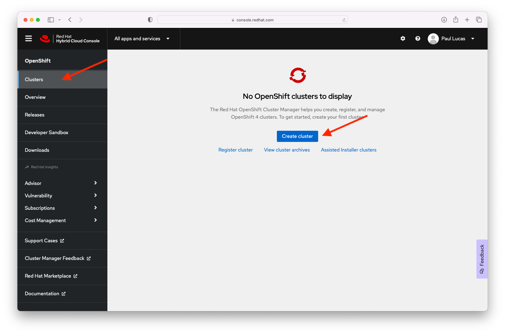
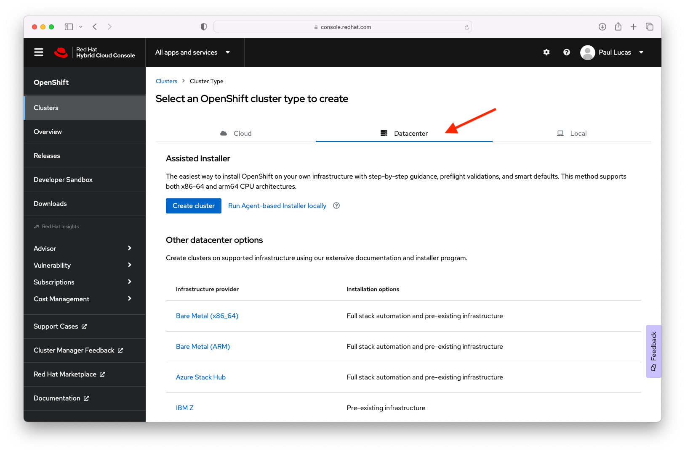
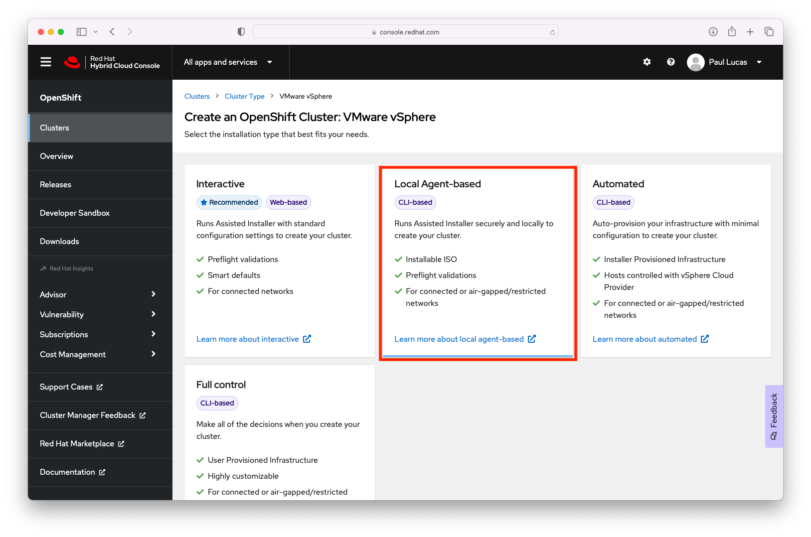
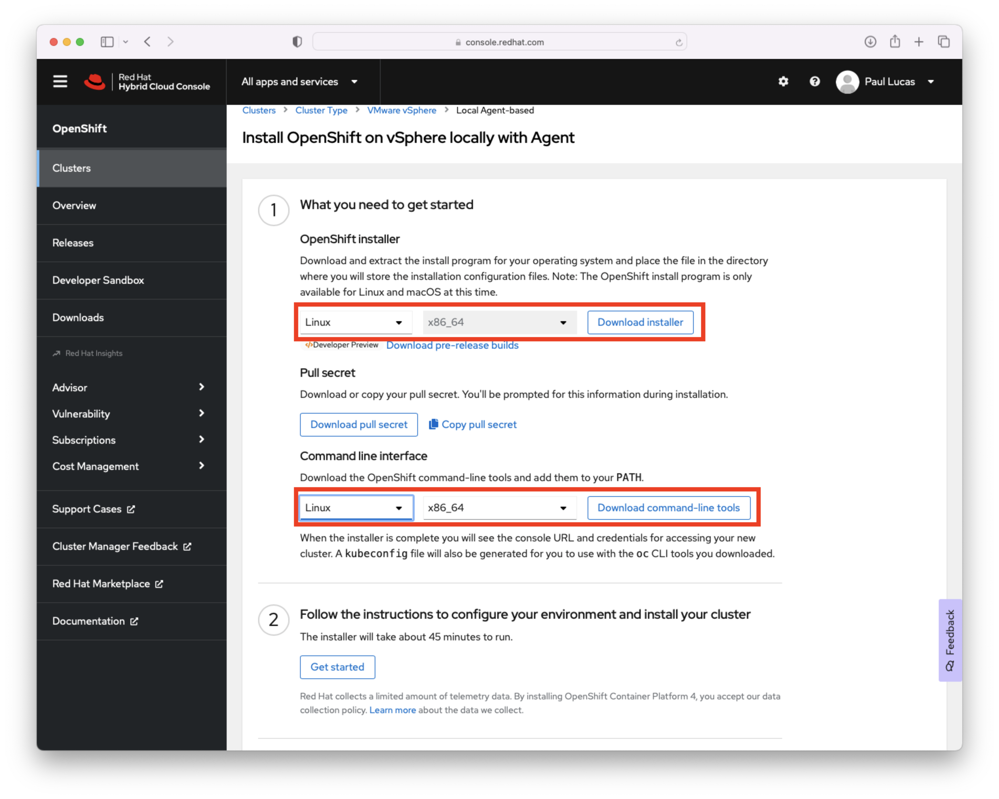

# OpenShift 4.12 vSphere Installer Provisioned Infrastructure Tutorial

In progress on 10 March 2023


The release of OpenShift 4.7 added a new vSphere Installer Provisioned Installation (IPI) option that makes it very easy to quickly spin up an OCP cluster in an EXSi environment.  This is great for testing or development.

The "straight" out of the box installation creates three control plane nodes and three worker nodes with minimal effort.  The vSphere IPI installation optional supports additional customizations, but in this example I will not use any of the customization capabilities.

For this tutorial I'm using a home built lab made up of three x86 8-core 64GB RAM machines formally used for gaming purposes.  The EXSI environment is a bare bones VMWare vSphere Essentials 7.0.3 setup.  I'm also using a two bay Synology NAS for shared storage across the vSphere cluster.  Finally I ran the installation from a RHEL 8 server instance that was hosting both DNS and DHCP services.  All the following instructions are run from a terminal on this RHEL 8 server VM running in my vSphere cluster.


## Installation Steps

### Installation Pre-reqs:
For this OCP 4.12 IPI vSphere installation, you need DNS and DHCP available to the cluster.  My DHCP server is setup to dynmically update the DNS services with hostname and address.

- For the OCP 4.12 IPI you need to define two static IP address.  One for the cluster api access api.ocp4.example.com and one for cluster ingress access *.apps.ocp4.example.com. For my lab I use example.com as the domain.  


 File Name | Location | Info
 ----------|----------|------
 db.10.1.10.in-addr.arpa | /var/named/dynamic | reverse zone file
 db.example.com | /var/named/dynamic | forward zone file


  - Add the following to the forward zone db.example.com file
```
  api.ocp4	IN	A	10.1.10.201
  *.apps.ocp4	IN	A	10.1.10.202
```
  
  - Add the following to the reverse zone db.10.1.10.in-addr.arpa file
```
  api.ocp4	A	10.1.10.201
  *.apps.ocp4	A	10.1.10.202
  201	IN	PTR	api.ocp4.example.com.
```

- Verify that both forward and reverse looks up are working
```        
# dig api.ocp4.example.com +short
10.1.10.201
# dig -x 10.1.10.201 +short
api.ocp4.example.
```      
    
- The DHCP service does not require any additional changes

### Optional - Create an ssh key for password-less ssh to the control-plane node for debugging, etc.
1. Create an ssh key 
```       
$ ssh-keygen -t ed25519 -N '' -f ~/.ssh/ocp412
Generating public/private ed25519 key pair.
Your identification has been saved in /home/pslucas/.ssh/ocp412.
Your public key has been saved in /home/pslucas/.ssh/ocp412.pub.
The key fingerprint is:
SHA256:8Md...ozN3Rcg pslucas@ns02.example.com
The key's randomart image is:
+--[ED25519 256]--+
| ...             |
+----[SHA256]-----+
```   
2. Start up the ssh-agent and add the new key to the ssh-agent. 
```
$ eval "$(ssh-agent -s)"
Agent pid 2247442
$ ssh-add ~/.ssh/ocp412
Identity added: /home/pslucas/.ssh/ocp412 (pslucas@ns02.example.com)
``` 
  
 ### Get the OCP 4.12 installation software
 - Login to [Red Hat Hybrid Cloud Console](https://console.redhat.com).  On the Red Hat Hybrid Cloud Console page, click the Openshift side tab

  
  
- On the Openshift page of the Red Hat Hybrid Console page, choose the Clusters tab on the side and the click the blue Create Cluster button

  

- On the Clusters > Cluster Type page, click the Datacenter tab and scroll down on the screen and click the vSphere link

 

- On the Clusters > Cluster Type > VMWare vSphere page, click on the Local Agent-based tile

 
 
- On the Clusters > Cluster Type > VMWare vSphere page > Local Agent-based install page choose the operating system where you will run the OpenShift installer (Linux or Mac).  Choose the operating system for the Command line interface (Linux, Mac, or Windows).  Download the OpenShift Installer, the Pull secret and the Command line interface. 
 
 
 
 - I made a separate directory named ocp412 in my home directory to run the installation for the OCP cluster.  Move thet openshift-install-linux.tar.gz and pull-secret files there.  In your "install" directory untar the openshift-install-linux.tar.gz

```
$ tar xvf openshift-install-linux.tar.gz
```

- For the installation, we need the vCenter’s trusted root CA certificates to allow the OCP installation program to access your vCenter via it's API.  You can download the vCenter cerfiticates via the vCenter URL.  My vCenter URL is https://vsca01.example.com/certs/download.zip
  
  
- Unzip the download.zip file that contains the vCenter certs.  In the certs folder you'll see three subfolders for linux, mac and windows.  You can use the "tree certs" command to see the files and file structure.
  
```
$ tree certs
certs
├── lin
│   ├── 77850363.0
│   └── 77850363.r0
├── mac
│   ├── 77850363.0
│   └── 77850363.r0
└── win
    ├── 77850363.0.crt
    └── 77850363.r0.crl

3 directories, 6 files
```
- Run the following commands to update your system trust.
 
``` 
$ sudo cp certs/lin/* /etc/pki/ca-trust/source/anchors
$ sudo update-ca-trust extract
```  
  
- We are now ready to deploy the cluster.  Change to the installation directory.  In the installation directory create a directory to store the installation artifacts (configuration, authentication information, log files, etc.)  I called my installation artifacts directory ocp.  

At the time that I created this article, there was a known bug in the OpenShift installer for 4.12 and you will have to generate the install-config.yaml first and then modify it to run the installation.  See this Red Hat Knowledge center article - [Fail to install OCP cluster on VMware vSphere and Nutanix as apiVIP and ingressVIP are not in machine networks](https://access.redhat.com/solutions/6994972)
 
- Due to the bug, the install is a two step process.  First we will run the install command create install-config command to generate the install-config.yaml that we will modify.  The install command will step you through a set of questions regarding the installation.  Some answers may be pre-populated for you and you can use the up/down arrow key to chose the appropriate response.
  
   Here is the list of questions the installer will ask you:  
        + 1.  SSH Public Key. 
        + 2.  Platform - chose vSphere   
        3.  vCenter - provide the url to your vCenter - vsca01.exanple.com  
        4.  Username - the username for your vCenter - administator@vsphere.local  
        5.  Password - the password for your vCenter user - *******  
        6.  Default Datastore - chose the vSphere datastore where the VMs will be stored.  
        7.  Virtual IP address for API - this is the API IP address we perviously add to our DNS service - 10.0.0.1  
        8.  Virtual IP address for Ingress - this is the ingress IP address we perviously add to our DNS service - 10.0.0.2  
        9.  Base Domain - example.com  
        10. Cluster Name - ocp4  
        11. Pull Secret - Copy and past the pull secret you downloaded in step 3.  
 ```
 $ ./openshift-install create install-config --dir=ocp4
? SSH Public Key /home/pslucas/.ssh/ocp412.pub
? Platform vsphere
? vCenter vsca01.example.com
? Username administrator@vsphere.local
? Password [? for help] *********
INFO Connecting to vCenter vsca01.example.com     
INFO Defaulting to only available datacenter: LabDatacenter 
INFO Defaulting to only available cluster: LabCluster 
? Default Datastore LabDatastore
INFO Defaulting to only available network: VM Network 
? Virtual IP Address for API 10.0.0.1
? Virtual IP Address for Ingress 10.0.0.2
? Base Domain example.com
? Cluster Name ocp4
? Pull Secret [? for help] ***************************************************************************************************
INFO Install-Config created in: ocp4
 ```
 
 - You will modify two sections in the install-configy.yaml file.  Under the networking section modify the cidr under the machineNetwork section.
 
 ```
 networking:
  clusterNetwork:
  - cidr: 10.128.0.0/14
    hostPrefix: 23
  machineNetwork:
  - cidr: 10.1.10.0/24
 ```
- Under the platform section modify both the apiVIPs and ingressVIPs IP addresses.
 ```
 platform:
  vsphere:
    apiVIPs:
    - 10.1.10.201
    cluster: LabCluster
    datacenter: LabDatacenter
    defaultDatastore: LabDatastore
    ingressVIPs:
    - 10.1.10.202
 ```
- Now run the installation with the create cluster option.
 ```   
$ $ ./openshift-install create cluster --dir ./ocp4 --log-level=info
INFO Consuming Install Config from target directory 
INFO Obtaining RHCOS image file from 'https://rhcos.mirror.openshift.com/art/storage/prod/streams/4.12/builds/412.86.202301311551-0/x86_64/rhcos-412.86.202301311551-0-vmware.x86_64.ova?sha256=' 
INFO Creating infrastructure resources...         
INFO Waiting up to 20m0s (until 4:55PM) for the Kubernetes API at https://api.ocp4.example.com:6443... 
INFO API v1.25.4+a34b9e9 up                       
INFO Waiting up to 30m0s (until 5:07PM) for bootstrapping to complete... 
INFO Destroying the bootstrap resources...        
INFO Waiting up to 40m0s (until 5:33PM) for the cluster at https://api.ocp4.example.com:6443 to initialize... 
INFO Checking to see if there is a route at openshift-console/console... 
INFO Install complete!                            
INFO To access the cluster as the system:admin user when using 'oc', run 'export KUBECONFIG=/home/pslucas/ocp412/ocp4/auth/kubeconfig' 
INFO Access the OpenShift web-console here: https://console-openshift-console.apps.ocp4.example.com 
INFO Login to the console with user: "kubeadmin", and password: "SAxqE-nIMI5-FyZIJ-zBEjz" 
INFO Time elapsed: 39m9s  
 ``` 
 While the installation is running you view the bootstrap VM creating the control-plane VMs and the worker VMs.
 
- Wait for the install to complete.  You'll see a series of messages like those below as the install progresses.  This installation in my lab took about 38 minutes.

 ``` 
INFO Obtaining RHCOS image file from 'https://releases-art-rhcos.svc.ci.openshift.org/art/storage/releases/rhcos-4.5/45.82.202007141718-0/x86_64/rhcos-  45.82.202007141718-0-vmware.x86_64.ova?sha256=9c977abeba0aeedc222ae9dd3d27e659bb5c959c9fd6b199f940d16de07ded4e' 
INFO The file was found in cache: /home/pslucas/.cache/openshift-installer/image_cache/187f73af432c837eaa23361023b1656c. Reusing... 
INFO Creating infrastructure resources...         
INFO Waiting up to 20m0s for the Kubernetes API at https://api.ocp4.example.com:6443... 
INFO API v1.18.3+3107688 up                     
INFO Waiting up to 40m0s for bootstrapping to 
INFO Waiting up to 30m0s for the cluster at https://api.ocp4.example.com:6443 to initialize... *
W0723 17:47:56.542835   31492 reflector.go:326] k8s.io/client-go/tools/watch/informerwatcher.go:146: watch of *v1.ClusterVersion ended with: very short watch: k8s.io/client-go/tools/watch/informerwatcher.go:146: Unexpected watch close - watch lasted less than a second and no items received
INFO Waiting up to 10m0s for the openshift-console route to be created...
INFO Install complete!                           
INFO To access the cluster as the system:admin user when using 'oc', run 'export KUBECONFIG=/home/pslucas/ocp45install/ocp45/auth/kubeconfig' 
INFO Access the OpenShift web-console here: https://console-openshift-console.apps.ocp4.example.com
INFO Login to the console with user: "kubeadmin", and password: “K**************************98” 
INFO Time elapsed: 37m47s      
```

- You are ready to use your OCP 4.7 Cluster.  Don't forget to install the command line client that you downloaded  earlier.

 ### Appendix
 - [OpenShift Container Platform 4.12 Documentation](https://docs.openshift.com/container-platform/4.12/welcome/index.html)
