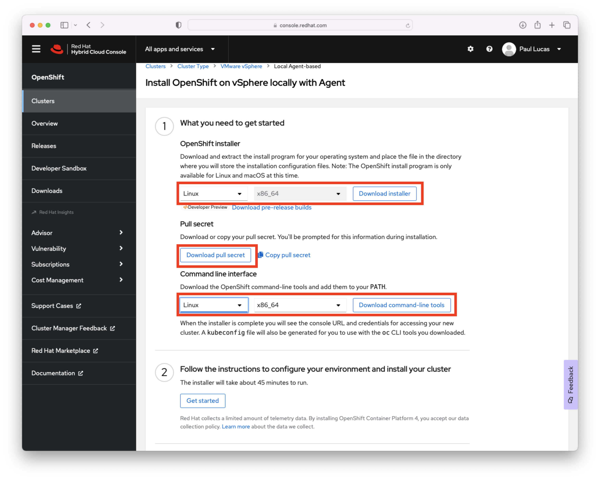
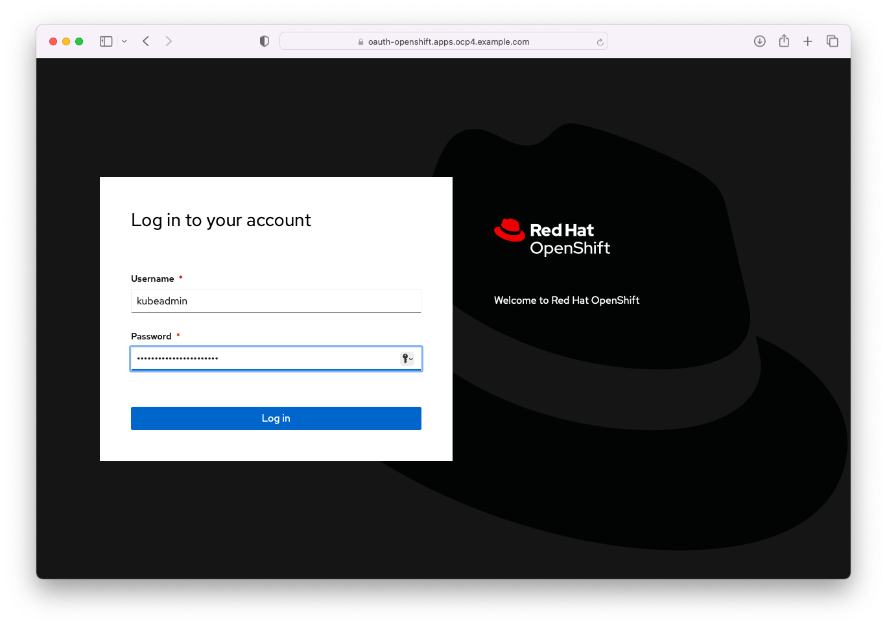
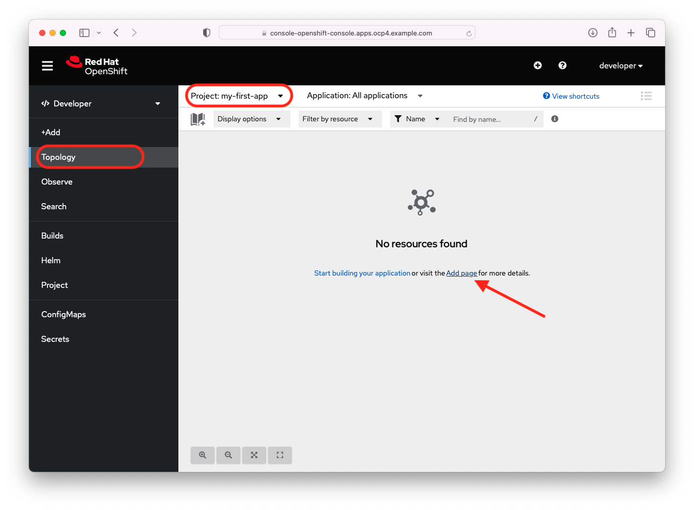
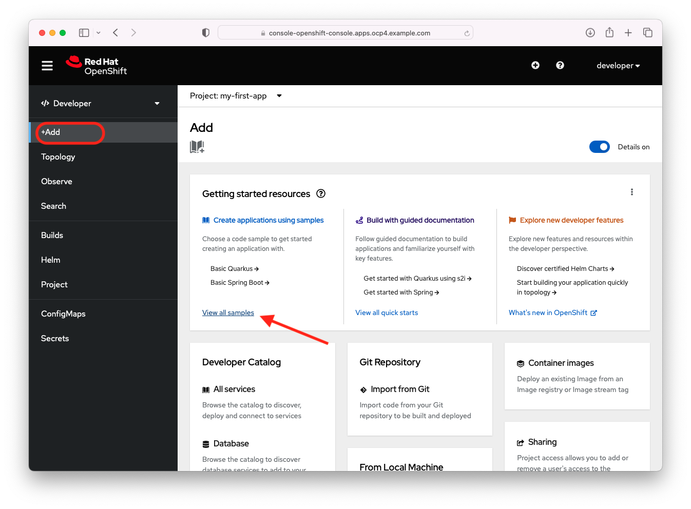
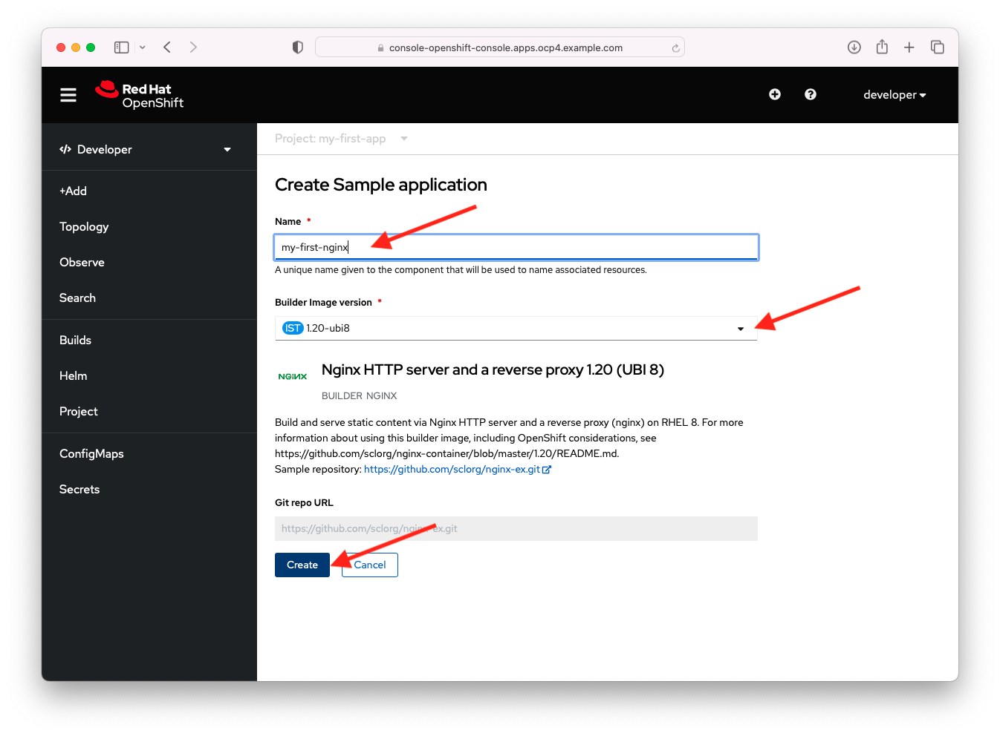
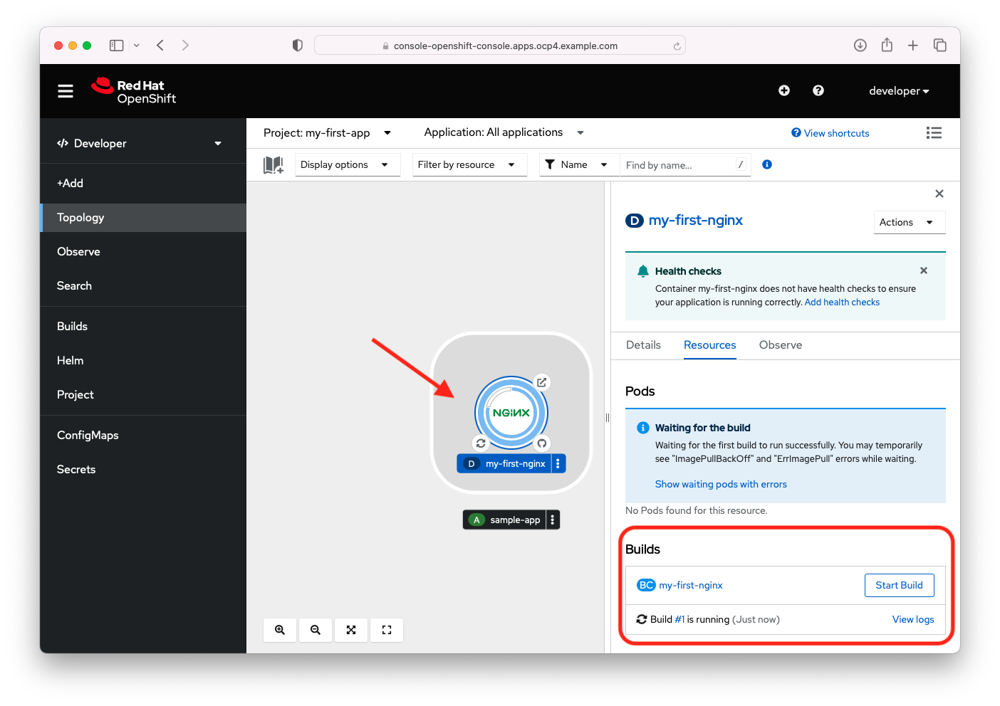
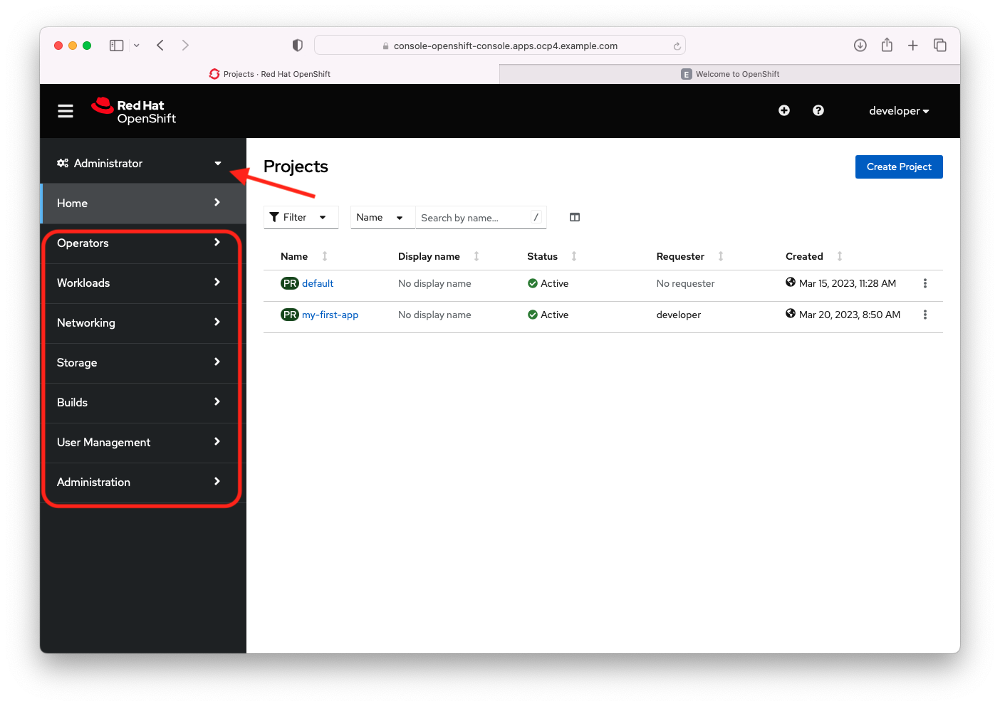

# OpenShift 4.12 vSphere Installer Provisioned Infrastructure Tutorial

Split into three parts for publication - 2023-03-31
- [Installing OpenShift on vMWare and Deploying a Sample Application - Part 1](https://github.com/pslucas0212/OpenShiftOnVMWare-Part-1)
- [Installing OpenShift on vMWare and Deploying a Sample Application - Part 2](https://github.com/pslucas0212/OpenShiftOnVMWare-Part-2)
- [Installing OpenShift on vMWare and Deploying a Sample Application - Part 3](https://github.com/pslucas0212/OpenShiftOnVMWare-Part-3)

By Paul Lucas

The release of Red Hat OpenShift 4.7 added a new vSphere Installer Provisioned Installation (IPI) option that makes it very easy to quickly provision an OpenShift cluster in a VMWare EXSi environment.  This cluster could be used for some quick testing or development.

The "straight" out of the box installation creates three control plane nodes and three worker nodes with minimal effort.  The EXSi IPI installation optional supports additional customizations, but in this example I will not use any of the customization capabilities.

For this tutorial I'm using a home built lab made up of three x86 8-core 64GB RAM machines formerly used for gaming purposes.  The EXSi environment is a bare bones VMWare vSphere Essentials 7.0.3 setup.  I'm using a two bay Synology NAS for shared storage across the vSphere cluster.  Finally I ran the installation from a RHEL 8 server instance that was hosting both DNS and DHCP services.  The command line instructions are run from a terminal of a RHEL 8 server VM running in this vSphere cluster.


## Installation Steps

### Installation Pre-reqs:
For an OpenShift 4.12 IPI vSphere installation, you need DNS and DHCP available for the cluster. 

- For the OpenShift 4.12 IPI you need to define two static IP addresses.  One for the cluster api access api.ocp4.example.com and one for cluster ingress access *.apps.ocp4.example.com. For my lab I use example.com as the domain.  


 File Name | Location | Info
 ----------|----------|------
 db.10.1.10.in-addr.arpa | /var/named/dynamic | reverse zone file
 db.example.com | /var/named/dynamic | forward zone file


  - Add the following to the forward zone db.example.com file.
```
  api.ocp4	IN	A	10.1.10.201
  *.apps.ocp4	IN	A	10.1.10.202
```
  
  - Add the following to the reverse zone db.10.1.10.in-addr.arpa file.
```
  api.ocp4	A	10.1.10.201
  *.apps.ocp4	A	10.1.10.202
  201	IN	PTR	api.ocp4.example.com.
```

- Verify that both forward and reverse look up are working.
```        
# dig api.ocp4.example.com +short
10.1.10.201
# dig -x 10.1.10.201 +short
api.ocp4.example.
```      
    
- The DHCP service does not require any additional changes.

### Create an ssh key for authentication to the control-plane node.
1. Create an ssh key for the installation.
```       
$ ssh-keygen -t ed25519 -N '' -f ~/.ssh/ocp412
Generating public/private ed25519 key pair.
Your identification has been saved in /home/pslucas/.ssh/ocp412.
Your public key has been saved in /home/pslucas/.ssh/ocp412.pub.
The key fingerprint is:
SHA256:qX0W...AZU pslucas@ns02.example.com
The key's randomart image is:
+--[ED25519 256]--+
|. oB*B+.         |
|       ...       |
|      . += .     |
+----[SHA256]-----+

```   
2. Start up the ssh-agent and add the new key to the ssh-agent. 
```
$ eval "$(ssh-agent -s)"
Agent pid 2383424
$ ssh-add /home/pslucas/.ssh/ocp412
Identity added: /home/pslucas/.ssh/ocp412 (pslucas@ns02.example.com)
``` 
  
 ### Get the OCP 4.12 installation software
 - Login to [Red Hat Hybrid Cloud Console](https://console.redhat.com).  On the Red Hat Hybrid Cloud Console page, click on the OpenShift side tab.

  
  
- On the OpenShift page of the Red Hat Hybrid Console page, choose the Clusters tab on the side and the click the blue Create Cluster button.

  

- On the Clusters > Cluster Type page, click the Datacenter tab and scroll down on the screen and click the vSphere link.

 

- On the Clusters > Cluster Type > VMWare vSphere page, click on the Local Agent-based tile.

 
 
- On the Clusters > Cluster Type > VMWare vSphere page > Local Agent-based install page choose the operating system where you will run the OpenShift installer (Linux or Mac).  Choose the operating system for the Command line interface (Linux, Mac, or Windows).  Download the OpenShift Installer, the Pull secret and the Command line interface. 
 
 
 
 - I made a separate directory named ocp412 in my home directory to run the installation for the OpenShift cluster.  Move thet openshift-install-linux.tar.gz and pull-secret files there.  In your install directory untar the openshift-install-linux.tar.gz

```
$ tar xvf openshift-install-linux.tar.gz
```

- For the installation, we need the vCenter’s trusted root CA certificates to allow the OpenShift installation program to access your vCenter via it's API.  You can download the vCenter certificates via the vCenter URL.  For example, my vCenter URL to download the vCenter certificates is https://vsca01.example.com/certs/download.zip
  
  
- Unzip the download.zip file that contains the vCenter certificates.  With a Linux client you can use the "tree certs" command to see the files and file structure.
  
```
$ tree certs
certs
├── lin
│   ├── 77850363.0
│   └── 77850363.r0
├── mac
│   ├── 77850363.0
│   └── 77850363.r0
└── win
    ├── 77850363.0.crt
    └── 77850363.r0.crl

3 directories, 6 files
```
- Use the following commands to update your system trust.
 
``` 
$ sudo cp certs/lin/* /etc/pki/ca-trust/source/anchors
$ sudo update-ca-trust extract
```  

- We are now ready to deploy the OpenShift cluster.  Change to the installation directory.  

At the time that I created this article, there was a known bug in the OpenShift installer for 4.12 and you will have to generate the the install-config.yaml first and then modify it to run the installation.  See this Red Hat Knowledge center article - [Fail to install OCP cluster on VMware vSphere and Nutanix as apiVIP and ingressVIP are not in machine networks](https://access.redhat.com/solutions/6994972)
 
- Due to the bug, the install is a two step process.  First we will run the install command with install-config option to generate the install-config.yaml that we will modify.  

- The install command will step you through a set of questions regarding the installation.  Some answers may be pre-populated for you and you can use the up/down arrow key to choose the appropriate response.  You can copy and paste the pull secret into the final question.  Press the enter key after each selection.  The OpenShift installation program creates a directory to store the installation artifacts (configuration, authentication information, log files, etc.)  I called my installation artifacts directory ocp4 (--dir=ocp4).  See the following completed example.
   
 ```
 $ ./openshift-install create install-config --dir=ocp4
? SSH Public Key /home/pslucas/.ssh/ocp412.pub
? Platform vsphere
? vCenter vsca01.example.com
? Username administrator@vsphere.local
? Password [? for help] *********
INFO Connecting to vCenter vsca01.example.com     
INFO Defaulting to only available datacenter: LabDatacenter 
INFO Defaulting to only available cluster: LabCluster 
? Default Datastore LabDatastore
INFO Defaulting to only available network: VM Network 
? Virtual IP Address for API 10.0.0.1
? Virtual IP Address for Ingress 10.0.0.2
? Base Domain example.com
? Cluster Name ocp4
? Pull Secret [? for help] ***************************************************************************************************
INFO Install-Config created in: ocp4
 ```
 
 - After creating the install-config.yaml file, you will modify two sections in the install-config.yaml file.  Under the networking section modify the cidr under the machineNetwork section.
 
 ```
 networking:
  clusterNetwork:
  - cidr: 10.128.0.0/14
    hostPrefix: 23
  machineNetwork:
  - cidr: 10.1.10.0/24
 ```
- Under the platform section modify both the apiVIPs and ingressVIPs IP addresses.
 ```
 platform:
  vsphere:
    apiVIPs:
    - 10.1.10.201
    cluster: LabCluster
    datacenter: LabDatacenter
    defaultDatastore: LabDatastore
    ingressVIPs:
    - 10.1.10.202
 ```
- Now run the installation with the create cluster option. You'll see a series of messages like those below as the install progresses.  This installation in my lab took about 39 minutes.

- While the installation is running you can view the bootstrap VM creating the control-plane VMs and then the worker VMs in the vSphere client.
 ```   
$ $ ./openshift-install create cluster --dir ./ocp4 --log-level=info
INFO Consuming Install Config from target directory 
INFO Obtaining RHCOS image file from 'https://rhcos.mirror.openshift.com/art/storage/prod/streams/4.12/builds/412.86.202301311551-0/x86_64/rhcos-412.86.202301311551-0-vmware.x86_64.ova?sha256=' 
INFO Creating infrastructure resources...         
INFO Waiting up to 20m0s (until 4:55PM) for the Kubernetes API at https://api.ocp4.example.com:6443... 
INFO API v1.25.4+a34b9e9 up                       
INFO Waiting up to 30m0s (until 5:07PM) for bootstrapping to complete... 
INFO Destroying the bootstrap resources...        
INFO Waiting up to 40m0s (until 5:33PM) for the cluster at https://api.ocp4.example.com:6443 to initialize... 
INFO Checking to see if there is a route at openshift-console/console... 
INFO Install complete!                            
INFO To access the cluster as the system:admin user when using 'oc', run 'export KUBECONFIG=/home/pslucas/ocp412/ocp4/auth/kubeconfig' 
INFO Access the OpenShift web-console here: https://console-openshift-console.apps.ocp4.example.com 
INFO Login to the console with user: "kubeadmin", and password: "SAxqE-...-zBEjz" 
INFO Time elapsed: 39m9s  
 ``` 

- You can now log into your newly created OpenShift cluster using kubeadmin and the password created during the installation.


- You will now be at the Homepage of your OpenShift cluster.  


- You are ready to use your OCP 4.12 Cluster.  Don't forget to install the command line client that you downloaded  earlier.

### Install the Command Line Interface
 
You have the choice of installing the OpenShift Command Line interface for Linux, Mac or Windows.  In this part of the tutorial, I'm going to set up the command line on the Red Hat Enterprise Linux 8 server that I used for the installation of the OpenShift cluster.

- Untar the OpenShift client.
```
$ tar xvf openshift-client-linux.tar.gz 
README.md
oc
```
- Move the oc and kubectl files to the /usr/local/bin directory.
```
$ sudo mv oc /usr/local/bin
$ sudo mv kubectl /usr/local/bin 
```

- Export the Kubeconfig file.  Be sure to permanently add the export to your startup.
```
export KUBECONFIG=/home/pslucas/ocp412/ocp4/auth/kubeconfig
```
- Now you can test your login to your OpenShift cluster.
```
$ oc login -u kubeadmin -p SAxqE-...-zBEjz https://api.ocp4.example.com:6443
The server uses a certificate signed by an unknown authority.
You can bypass the certificate check, but any data you send to the server could be intercepted by others.
Use insecure connections? (y/n): y

WARNING: Using insecure TLS client config. Setting this option is not supported!

Login successful.

You have access to 67 projects, the list has been suppressed. You can list all projects with 'oc projects'

Using project "default".
Welcome! See 'oc help' to get started.
```

### Create a local image registry

- During this OpenShift installation, OpenShift skips creating an internal image registry since it isn't aware of shareable object storage that you might be using with a quick installation like in this example.  For our openshift cluster, we will use the available VMWare datastore to define storage for our cluster.

- We will enable the registry by first creating a persistent volume claim via the command line.
```
$ cat <<EOF >> image-registry-pvc.yaml
> apiVersion: v1
> kind: PersistentVolumeClaim
> metadata:
>   name: image-registry-storage
>   namespace: openshift-image-registry
> spec:
>   accessModes:
>     - ReadWriteOnce
>   resources:
>     requests:
>       storage: 100Gi
>   storageClassName: 'thin'
> EOF
$ oc apply -f image-registry-pvc.yaml 
persistentvolumeclaim/image-registry-storage created
```

- Next we will patch the image registry operatory config.
```
$ oc apply -f image-registry-pvc.yaml 
persistentvolumeclaim/image-registry-storage created
```
 - Wait a couple of minutes for the image registry pod to start.  And we are all set.
```
$ oc get pods -n openshift-image-registry -l docker-registry=default
NAME                              READY   STATUS    RESTARTS   AGE
image-registry-7b55cf555c-8mj66   1/1     Running   0          9m17s
```

### Let's set up a couple of users
- We don't recommend using kubeadmin on a day-to-day basis for administering your OpenShift cluster, we will create two users in this tutorial to start to familiarize you with the process for creating users and groups.  For ease of the tutorial, we will use htpasswd to set up some basic authentication for our OpenShift cluster.  First we will create a temporary htpasswd authentication file and add two users to it. 
```
$ touch /tmp/cluster-ids
$ htpasswd -B -b /tmp/cluster-ids admin xxxxxxxx
Adding password for user admin
$ htpasswd -B -b /tmp/cluster-ids developer xxxxxxxx
Adding password for user developer
```

- Next we will create a secret from the htpasswd file.
```
$ oc create secret generic cluster-users --from-file htpasswd=/tmp/cluster-ids -n openshift-config
secret/cluster-users created
```

- We will now update the OAuth resource on our cluster and add the HTPasswd identity provider definition to the cluster's identity provider list.  Export the OpenShift cluster OAuth resource to a yaml file.
```
oc get oauth cluster -o yaml > /tmp/oauth.yaml
```
-  Update the spec section of the OAuth.yaml file.  After updating the file we will update our OpenShift cluster with the new yaml file.
```
spec: 
  identityProviders:
  - name: cluster-users
    mappingMethod: claim
    type: HTPasswd
    htpasswd:
      fileData:
        name: cluster-users
```
```
$ oc replace -f /tmp/oauth.yaml 
oauth.config.openshift.io/cluster replaced
```
- We will assign the cluster admin role to the admin user.  You can ignore the error as the admin doesn't exit until you log in the first time as the admin.
```
$ oc adm policy add-cluster-role-to-user cluster-admin admin
Warning: User 'admin' not found
clusterrole.rbac.authorization.k8s.io/cluster-admin added: "admin"
```
-  We will now need to wait until the oauth-openshift pods in the openshift-authetication space are restarted.
```
$ oc get pods -n openshift-authentication
NAME                               READY   STATUS    RESTARTS   AGE
oauth-openshift-64756f8997-h6ts8   1/1     Running   0          2m2s
oauth-openshift-64756f8997-hs6cl   1/1     Running   0          94s
oauth-openshift-64756f8997-z4mxz   1/1     Running   0          2m30s
```
- We can now login to our OpenShift cluster as the admin role to create a group and assign group cluster roles for the developer user.
```
$ oc login -u admin -p xxxxxxxx
WARNING: Using insecure TLS client config. Setting this option is not supported!

Login successful.

You have access to 67 projects, the list has been suppressed. You can list all projects with 'oc projects'

Using project "default".
```

- Let's create a group for the developers and add the developer user to the developers group.

```
$ oc adm groups new developers
group.user.openshift.io/developers created
$ oc adm groups add-users developers developer
group.user.openshift.io/developers added: "developer"
```
- Quick side note.  You can check who you are logged in as with whomai command.
```
$ oc whoami
admin

```

- We want developers to be able to create and delete project related resources.  We will give the developers group edit capability.
```
$ oc policy add-role-to-group edit developers
clusterrole.rbac.authorization.k8s.io/edit added: "developers"
```

- Currently the developers group has the ability to create new projects.  We can remove that capability from the group if that makes sense for your organization.  Let's login to the OpenShift cluster as a developer and create a new project
```
$ oc login -u developer -p xxxxxxxx
WARNING: Using insecure TLS client config. Setting this option is not supported!

Login successful.

You have one project on this server: "default"

Using project "default".
```
- Now that we are logged in as the developer, let's create a new project.  A project in OpenShift is a kubernetes namespace with additional annotations.
```
$ oc new-project my-first-app
Now using project "my-first-app" on server "https://api.ocp4.example.com:6443".

You can add applications to this project with the 'new-app' command. For example, try:

    oc new-app rails-postgresql-example

to build a new example application in Ruby. Or use kubectl to deploy a simple Kubernetes application:

    kubectl create deployment hello-node --image=k8s.gcr.io/e2e-test-images/agnhost:2.33 -- /agnhost serve-hostname
```

- Note we can see the current project with the oc project command.
```
$ oc project
Using project "my-first-app" on server "https://api.ocp4.example.com:6443".
```

### Installing a simple test application
- We have been doing a lot of work from the command line, so let's switch to the OpenShift Administration Console to set up our new application.

- Paste the OpenShift Administration Console url into a web browser.  The admin console url for my cluster looks like this - https://console-openshift-console.apps.ocp4.example.com. 

- At the admin console, click the cluster-users button and on the next screen provide your username and password, and then click the blue Log in button.  For this part of the tutorial we are going to login as the developer. 


- On the admin console in the upper right corner you will see that you are logged in as the developer.  In the Administrator perspective on the Home screen you will see two projects including the my-first-app project we just created.  You have two perspectives in the admin console, Administrator and Developer, that change the perspective to provide you with the tabs appropriate to the type of work or activities you would do in each role.  Click on the drop down near the upper left of your screen and choose Developer to change to the developer's perspective.  As the Developer, you do not have full admin rights to the OpenShift cluster as we didn't grant those to you earlier in the tutorial.


- In the Developer perspective make sure you are on the Topology tab and then click project drop down and choose the my-first-app project.


- Currently in the Topology view there are no application deployments. We can choose the +Add tab or click the Add age link to create a deployment from the sample applications.  Click the Add page link.



- On the add page click the View all sample link on the Create applications using samples tile.



- On the Samples page, start typing 'Ngin' in the search field and click on the Nginx tile.


- For our sample Nginx application let's give it the name 'my-first-nginx' in the Name text field and choose the 1.20-ubi8 image version from the Builder Image version drop down list.  For our sample I chose the Nginx running in the Universal Base Image (UBI) 8.  Feel free to choose any UBI version.  Finally click the blue Create button to start our deployment.



- When the build deployment starts, the first step is creating the build of the application.  The admin console will take you to the Topology view and you will see the deployment tile for our application.  Click on the tile to bring up the details of our deployment and you will see the Build is in process.



- When you see that the build is complete, scroll down and you will see that Services and a Route has been created for our deployment.  Click the Route link for my-first-nginx deployment to see the application.


- Congratulations!  You've successfully installed a Red Hat OpenShift cluster, created users, created your first project and deployed your first application.


- Back at the Topology view, you can right click the three dots on the deployment button of the my-first-nginx deployment to bring up a context senstive menu.  From here you can easily view and/or edit additional deployment options.


- Change your perspective back to the Administrator perspective and look through the other configuration settings we created earlier via the command line.  You can also perform the activies we did previously on the command line through Adminstrator perspective in the admin console.



### Summary
In this tutorial we have seen how easily and quickly we can provision a standalone Red Hat OpenShift cluster to an EXSi environment via the Installer-provisioned Installation (IPI). We can use this standalone OpenShift cluster for some quick testing or development.  We've seen how we can easily use the 100% kubernetes compliant command line to create projects and users.  We have seen how easy it is to use the intuitive OpenShift Administrator Console to create, configure, manage and monitor kubernetes objects in our OpenShift cluster.

OpenShift provides you with an end-to-end enterprise ready kubernetes environment with all the tools.  Openshift supports you from development and testing kubernetes based applications on the desktop and to deploying these applications to a production OpenShift cluster.  Red Hat provides you with all the tools you need to automate your development and deployments.  If you have a favorite tool or product you would like to use with OpenShift for development, CI/CD pipelines, security, etc., you can add those tools to your 100% kubernetes compliant OpenShift cluster.


 ### Appendix
 - [OpenShift Container Platform 4.12 Documentation](https://docs.openshift.com/container-platform/4.12/welcome/index.html)
